# java-database-2026
자바개발자 과정 데이터베이스 리포지토리

## Day01

### 데이터/정보

데이터는 단순한 컴퓨터환겨의 특정 값을 의미, 정보는 데이터에 의미를 부여한 것

### 데이터베이스(DataBase : DB)

데이터를 기반으로 하는 관리 시스템을 의미. 데이터를 보아둔 장소를 의미하기도 함

- DataBase Management System 을 줄여서 DBMS라고 부름
- DBMS를 줄여서 DB라고도 함
- 대부분 기업의 `도메인 정보`를 저장하고 있음
- IT에서 가장 중요하게 생각해야할 기술중 하나


### 데이터베이스 종류
- 관계형 데이터베이스(RDBMS)
    - `Oracle` - 학습할 DB
    - SQLServer - Microsoft사 제품. Oracle보다 성능이 낮음
    - MySQL - 오프소스진영에서 Oracle로 합병
    - MariaDB - MySQL 개발자들이 다시 만든 오픈소스 DB
    - PostgreSQL - 오픈소스 데이터베이스

- NoSQL 데이터베이스(빅데이터...)
    - Redis
    - MongoDB
    - Apache Cassandra

- In-Memory 데이터베이스
    - SAP HANA (겁나 빠름)


### 오라클 설치 방법
1. 로컬 설치 

    

2. 도커 설치(클라우드 동일)

    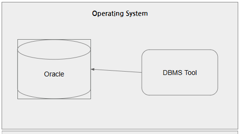

### 오라클 설치 이전

1. 도커 설치 - DevOps의 필수품
    - https://www.docker.com/
    - Download Docker Desktop 버틑 클릭
    - Download for Windows - AMD64 선택

2. 설치 후 실행
    - Settings(오른쪽 상단 기어모양) 클릭
    - Start Docker Desktop when... 체크 후 Apply

### 오라클 설치

1. Docker Desktop에서 검색 후 Pull로 이미지 다운로드 가능 - 하지말 것

2. Docker Command 사용

    - Powershell 오픈 후, 도커 실행 확인

        ```bash
        docker --version
        Docker version 29.2.1, build a5c7197
        ```

    - 이미지 검색

        ```bash
        docker search oracle-xe
        NAME                      DESCRIPTION                                      STARS     OFFICIAL
        gvenzl/oracle-xe          Oracle Database XE (21c, 18c, 11g) for every…   355      **
        owncloudci/oracle-xe                                                       0
        abstractdog/oracle-xe                                                      0
        ```
    
    - 이미지 당겨오기

        ```bash
        docker pull gvenzl/oracle-xe:21-slim
        ```

        

    - 컨테이너 실행

        ```bash
        docker run -d --name oracle-xe -p 1521:1521 -e ORACLE_PASSWORD=P12345s! gvenzl/oracle-xe:21-slim
        ``` 

        

    - 멈춰있는 컨테이너 실행

        ```bash
        docker start [컨테이너ID]
        ```
        
    - 컨테이너 자동실행 명령

        ```bash
        docker update --restart=always [컨테이너ID]
        ```

    - 컨테이터 내부 접속

        ```bash
        docker exec -it oracle-xe sqlplus system/P12345s!@XE
        
        SQL*Plus: Release 21.0.0.0.0 - Production on Thu Feb 26 04:44:25 2026
        Version 21.3.0.0.0

        Copyright (c) 1982, 2021, Oracle.  All rights reserved.

        Last Successful login time: Thu Feb 26 2026 03:18:25 +00:00

        Connected to:
        Oracle Database 21c Express Edition Release 21.0.0.0.0 - Production
        Version 21.3.0.0.0

        SQL> 
        ```
    
    - 강의용 사용자 생성

        ```sql
        CREATE USER java IDENTIFIED BY java12345;

        GRANT CONNECT, RESOURCE TO java;
        GRANT CREATE TABLE TO java;

        GRANT all privileges TO java;  -- INSERT등 추가권한 할당
        ```

### 데이터베이스 개발툴 설치

1. 개발툴 종류
    - SQL*Plus - 콘솔개발 화면. 가장 기초적인 SQL실행도구. 매우 사용불편
    - Oracle SQL Developer - 오라클사가 제공하는 무료툴. 오프소스. java개발툴 eclipse를 커스터마이징해서 개발
    - Toad for Oracle - DB개발툴 가장 강력한 SW. 상용라이선스
    - `DBeaver` - 오픈소스, 거의 모든 DB를 다 사용. 대중성이 매우 높음

2. DBeaver 설치
    - https://dbeaver.io/
    - Community Edition 클릭 Windows (Installer) 선택

3. VS Code 확장
    - Database Client, Database Client JDBC 확장 설치

    


### DBeaver 사용법

- Database Navigator 에서 DB연결 시작

    

    - 마우스 오른쪽버튼 > Create > Connection

        

    - 연결정보 입력 Test Connection
    - 입력 시 주의사항 : Port번호 확인, Database 이름변경 Oracle -> XE로, Username, Password 일치


        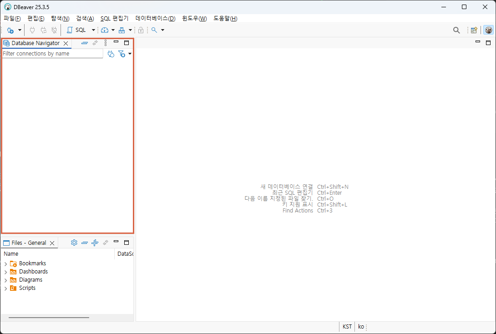


### 기본 사용법

- DBeaver
    - 연결된 XE - java > Schema(Database와 같은의미) 확장 > JAVA 선택
    - 마우스 오른쪽 버튼 > SQL 편집기
    - 글자 크기 변경 > 메뉴 윈도우 > 환경 설정
        - User Interface > 모양 > 색상 및 글꼴 > DBeaver Fonts > Monospace font를 편집

        

- 샘플 데이터베이스 생성

    1. 테이블 생성 : [쿼리](./day01/1.sample_schemas.sql)
    2. 시퀀스 생성 : [쿼리](./day01/2.sequences.sql)
    3. 부서데이터 추가 : [쿼리](./day01/3.department_datas.sql)
    4. 직원데이터 추가 : [쿼리](./day01/4.employee_datas.sql)
    5. 고객데이터 추가 : [쿼리](./day01/5.customer_datas.sql)
    6. 상품데이터 추가 : [쿼리](./day01/6.product_datas.sql)
    7. 주문과 주문상세데이터 추가 : [쿼리](./day01/7.order_order_item_datas.sql)

- 간단 연습 : [쿼리](./day01/8.샘플쿼리.sql)
    - DB 파일은 확장자를 `.sql`
    - 하나의 명령으로 ;으로 끝나는 문장을 쿼리(query)로 지칭
    - 쿼리문은 대소문자 구분 없음
    - DBeaver에서 쿼리 한줄 실행은 `Ctrl+Enter`
    - 여러줄 동시실행은 `Alt+x`

- SQL(Structured Query Language) 
    - 구조화된 질의 언어
    - 관계형 데이터베이스에서 DBMS상에 데이터를 정의, 조작, 제어하기 위해 사용하는 표준 프로그래밍 언어

## Day02

### DBeaver 사용법, DB작업시 사전지식
- 메뉴 상 용어들
    - 검색 > `DB Full-Text` - Full Text Search(대용량 텍스트 내에서 필요한 단어를 검색할 때)
    - SQL 편집기 > `실행계획` - 현재의 쿼리가 실행되는데 비용이 얼마나 발생하는지 파악하는 기술. 최적화 실행속도 빠르게 하기 전에 분석
    - 데이터베이스 > `트랜잭션` 모드 - 쿼리들이 실행되는 논리적 덩어리, Auto-Commit(조금 위험), None Commit


- 위 스키마 하위에서 지금 알아야 할 내용들
    - 테이블
    - 뷰
    - 인덱스
    - 스퀀스
    - 프로시저
    - 펑션
    - SQL 문법까지

### 기본, SELECT문

- 문법이전 데이터 타입 일부
    - `NUMBER` - 숫자타입, 최대 22byte
    - INTEGER - 정수타입, 모든 데이터 기초 4byte(-21억 ~ +21억)
    - FLOAT - 실수타입, 소수점포함, 최대 22byte
    - `CHAR`(n) - Character 문자열타입, 고정형, 최대 2000byte
        - CHAR(20)기분 'Hello World'를 저장하면, 'Hello World&nbsp;&nbsp;&nbsp;&nbsp;&nbsp;&nbsp;&nbsp;&nbsp;&nbsp;' 로 저장됨. 무조건 자리수를 20자리로 고정해서 생성
    - `VARCHAR2`(n) - 가변형문자열, 최대 4000byte
        - 오라클에서 VARCHAR(n)는 사용안함
        - VARCHAR2(20)으로 'Hello World'를 저장하면, 'Hello World'. 뒤에 9자리는 버림.
    - `LONG`(n) - 가변길이 문자열, 최대 2Gbyte
    - LONG RAW(n) - 바이너리(이진)데이터, 0과 1의 숫자로만 저장. 최대2Gbyte
    - CLOB - 대용량 텍스트타입, 최대 4Gbyte
    - BLOB - 대용량 바이너리타입, 최대 4Gbyte
    - `DATE` - 날짜타입. 문자열과 다름

- 데이터 조회 3가지 방법 - [쿼리](./day02/1.데이터조회방법.sql)
    - `셀렉션`(Selection) - 행단위로 조회
    - `프로젝션`(Projection) - 열단위로 조회
    - `조인`(Join) - 두 개 이상 테이블을 조합해서 조회

- SELECT 문법
    - 기본쿼리, 별명 - [쿼리](./day02/2.기본쿼리%20및%20별명지정쿼리.sql)
    - 중복제거 - [쿼리](./day02/3.중복제거쿼리.sql)
    - 정렬 - [쿼리](./day02/4.정렬쿼리.sql)
    - WHERE절 - [쿼리](./day02/5.조건쿼리.sql)

    ```sql
    -- 주석 한줄 주석
    /* 여러줄 
       주석(C언어 주석) */
    -- 기본 문법
    SELECT [*|열이름 나열]
      FROM [dual|테이블명];

    -- 별명추가
    SELECT 컬럼명 [AS 별명], 
           계산식 AS "별명",
           ...
      FROM 테이블명 [테이블별명];

    -- 데이터 정렬
    SELECT 위와동일
      FROM 테이블명
     ORDER BY [정렬할 열이름(여러개)][ASC|DESC];
    /*
    ASC - ascending(오름차순)
    DESC - descending(내림차순)
    ASC는 기본이고 생략가능
    */

    -- 조건절 WHERE절
    -- 원하는 조건으로 다양하게 조회할때
    SELECT 위와동일
      FROM 테이블명
    [WHERE 조회할 행을 선별하는 조건식]
    [ORDER BY [정렬할 열이름(여러개)][ASC|DESC]];
    ```

- SELECT 연산 - [쿼리](./day02/6.연산자.sql)

    ```sql
    -- 산술연산자 + - * /
    -- 비교연산자 >(크다) <(작다) >=(크거나같다) <=(작거나같다) ==(같다) <>, !=(같지않다)
    -- 논리부정연산자 NOT
    -- IN = OR와 동일
    -- BETWEEN
    ```

- 오라클 함수 : DB별로 추가학습 필요 - [쿼리](./day02/8.오라클함수.sql)

    - 문자열 함수 
        - `UPPER`(모두 대문자), `LOWER`(모두 소문자), `INITCAP`(첫글자만 대문자로)
        - `LENGTH`(문자열길이)
        - `SUBSTR`(문자열, 시작, 길이), 길이를 안적으면 끝까지 추출
        - `INSTR`(문자열, 찾을문자열, [횟수]), 문자열에서 찾을 문자열의 위치를 리턴
        - `REPLACE`(문자열, 찾는문자열, 바꿀문자열), 찾은 문자열을 바꿀문자열로 변경
        - `LPAD`(문자열, 자리수, 채울문자열), `RPAD`(문자열, 자리수, 채울문자열), L/R 기준으로 자리수만큼 빈공간 특정문자로 채우기
        - `CONCAT`(앞쪽문자열, 뒤쪽문자열), 두 문자열 합치기
        - `TRIM`(공백있는문자열), `LTRIM`(공백있는문자열), `RTRIM`(공백있는문자열), 문자열 앞뒤의 빈공백 제거

    - 숫자 함수
        - `ROUND`(반올림할수, 반올림위치)
        - `TRUNC`(숫자, 버림위치)
        - `CEIL`(올림할수)
        - `FLOOR`(내림할수)
        - `MOD`(나머지구할수)

### DB 특징 

- 모든 언어는 인덱스가 0부터 시작
- 단, `데이터베이스는 인덱스 1부터` 시작!

## Day03

### 함수

- 날짜포맷 단어
    - YYYY, YY - 년도 네자리(2026), 두자리(26)
    - MM, MON, MONTH - 월 두자리(03), MAR, MARCH
    - DD, DDD, DY, DAY - 일 두자리(03), 62(1월1일부터 며칠째), TUE(화), TUESDAY(화요일)
    - HH24, HH, HH12 - 24시간, 12시간표현
    - MI - 분
    - SS - 초
    - AM, PM - 오전, 오후

- 오라클 함수 계속 
    - 날짜함수 - [쿼리](./day03/1.오라클함수.sql)
        - `sysdate` - 기본. 현재 일시를 리턴
        - `ADD_MONTHS`(날짜컬럼, 정수) - 양수는 이후달, 음수는 이전달 
        - `MONTH_BEWTEEN`(비교날짜1, 비교날짜2) - 두 날짜사이의 개월 수
        - `NEXT_DAY`(날짜, '요일') - 날짜 이후의 해당요일 날짜 리턴
        - `LAST_DAY`(날짜) - 해당 날짜의 마지막일 리턴. 예) 2월28일 3월31일...

    - 형변환함수
        - `TO_CHAR`(날짜, '날짜포맷') - 날짜를 해당포맷에 맞게 변경해서 표현
        - `TO_CHAR`(숫자, '숫자포맷') - 숫자를 해당포맷에 맞게 변경 표현
        - `TO_NUMBER`(숫자로만된문자데이터, '숫자포맷') - 수로된 문자열을 숫자로 변경
        - `TO_DATE`(날짜형식문자데이터, '날짜포맷') - 문자데이터를 날짜데이터로 변경

    - NULL 처리함수 - [쿼리](./day03/2.NULL함수.sql)
        - `NULL`(데이터없음)은 일부 개수처리나 통계 불가, NULL값 처리필요
        - `NVL`(널이들어간데이터, 널처리(0)) - 해당 값이 NULL이면 보통 0으로 변환
        - `NVL2`(널이들어간데이터, 널이아닐때처리, 널일때처리) - 널이 아닐때와 널일때로 나눠서 처리

    - DECODE, CASE - [쿼리](./day03/3.decode_case.sql)
        - 특정열의 데이터가 어떤 데이터인지 따라 다르게 처리할때
        - python의 if ~ elif ~ elif와 동일한 의미
        - `DECODE`(컬럼, 조건, 결과, ...) - 오라클 전용함수
        - `CASE`문 - CASE ~ WHEN ~ THEN ~ END ... 

### 다중행, 데이터 그룹화

- 다중행(그룹) 함수 - [쿼리](./day03/4.다중행함수.sql)
    - 여러 행의 데이터를 바탕으로 하나의 결과를 도출하는 함수
    - `SUM`() - 데이터의 합. 급여, TAX, 점수 등 의미있는 데이터만 합할 것
    - `COUNT`() - 데이터 개수. NULL에 지대한 영향을 받음. 데이터형에 영향 받지 않음. *(ALL)도 가능
    - `AVG`() - 데이터의 평균. NULL에 영향을 받기때문에, NULL값은 항상 0등으로 변경해주고 계산
    - `MIN`() - 데이터 중 최소값. 날짜, 문자열도 가능
    - `MAX`() - 데이터 중 최대값. 날짜, 문자열도 가능

- 그룹화 - [쿼리](./day03/5.그룹화.sql)

    ```sql
    -- 나머지는 이전과 동일. 다중행함수화 GROUP BY가 추가.
    SELECT [기존과 동일], 다중행함수
      FROM [테이블명|dual]
     WHERE [조건식]
     GROUP BY [그룹화할 열 지정] [ROLLUP|CUBE|GROUPING SETS]
    HAVING [그룹함수 필터링]
     ORDER BY [정렬조건]

    ```

    - 그룹화 시 유의점
        - SELECT절에 다중행 함수 외 일반컬럼을 사용하고자 하면, 반드시 GROUP BY 절에 일반컬럼이 들어가 있어야 함!
        - `단일 그룹의 그룹 함수가 아닙니다` 오류 메시지 나타남

- HAVING절
    - 일반 SELECT절의 조건은 WHERE절로 처리
    - 다중행 함수 등의 조건은 HAVING절로 처리해야함
    - 다중행(그룹) 함수는 WHERE절에 사용불가

- 그룹화 관련 함수 - [쿼리](./day03/6.그룹화2.sql)
    - `ROLLUP` - 해당 컬럼별 합계 도출
    - `CUBE` - 해달 컬럼별 상세 소계 도출
    - GROUPING SETS - 차후...
    - `PIVOT` - 일반 데이터(세로출력)를 가로출력로 변경

### Sample DB 생성

```bash
> docker exec -it oracle-xe sqlplus sys/oracle as sysdba

SQL*Plus: Release 21.0.0.0.0 - Production on Tue Mar 3 05:56:46 2026
Version 21.3.0.0.0

Copyright (c) 1982, 2021, Oracle.  All rights reserved.

Connected to:
Oracle Database 21c Express Edition Release 21.0.0.0.0 - Production
Version 21.3.0.0.0

SQL> alter session set "_oracle_script"=true;
SQL> create user scott identified by tiger
  2  default tablespace users quota unlimited on users;
SQL> grant connect, resource, dba to scott;
SQL> alter session set "_oracle_script"=true;
SQL> alter session set nls_date_language='american';
SQL> alter session set nls_date_format='dd-MON-rr'; 
```

### 조인

- 조인 기본 - [쿼리](./day03/7.조인.sql)

## Day04

### 조인 

- 관계형 데이터베이스
    - 관련된 데이터를 테이블 형태로 저장하고, 테이블간 관계를 통해 데이터를 관리하는 DB모델
    - 테이블 - 데이터를 저장하는 구조. Table/Entity
    - 레코드/로우 - 관련 데이터가 모두 모인 하나의 데이터 행. Record/Row/Tuple
    - 컬럼 - 데이터 특징을 담는 하나의 속성, Column/Attribute
    - PK - 각 행의 유일하게 식별하는 키. 여러개의 PK를 가질 수도 있음. Primary Key
    - FK - 부모테이블의 PK와 관계를 맺는 키 Foreign Key

- ERD(Entity Relationship Diagram)
    - 관계형 데이터베이스 구조를 그림으로 표현한 설계도
    - 데이터베이스를 만들기 전에 어떤 테이블이 필요하고 어떤 관계를 맺어야 하는지 시각적 표현


- ERD 설명
    - PK - DEPT.DEPTNO, EMP.EMPNO
    - FK - EMP.DEPTNO
    - 일반컬럼 - 그외 나머지 컬럼
    - 부자관계 - DEPT(부), EMP(자)


- 조인 계속 - [쿼리](./day04/1.조인다시.sql)
    - 등가조인 - `내부조인`, `Inner Join`, Equi Join
    - 비등가조인 - 등가조인 외의 방법, Between 등 사용. 많이 사용안함
    - 셀프조인 - 자체조인. 자기 테이블을 조인. 자기 테이블내에 해당 PK와 관련있는 FK가 지정되어 있어야
        - 대부분 회사에서 조직도, 상사와 부하직원 관계볼때 사용
    - 외부조인 - 등가조인 반대. `Outer Join`. 조인 기준에서 일치하지 않는 데이터도 조회나오도록 하는 조인
        - 왼쪽외부조인 - `Left Outer Join`. 왼쪽 테이블 기준으로 오른쪽 테이블에 일치하지 않는 데이터 조회
        - 오른쪽외부조인 - `Right Outer Join`. 오른쪽 테이블 기준, 왼쪽 테이블에 일치하니 않는 데이터 조회

- SQL-99 표준문법 조인 - [쿼리](./day04/2.표준조인.sql)
    - JOIN ~ ON, INNER JOIN ~ ON - 내부조인, INNER는 생략 가능
    - LEFT|RIGHT OUTER JOIN ~ ON - 외부조인, LEFT, RIGHT는 생략 불가능

### 서브쿼리

- 서브쿼리
    - 메인쿼리 내에 소괄호()로 포함된 추가쿼리. `SubQuery`.
    - 대부분 조인으로 변경 가능
    - 대부분 서브쿼리부터 작성 추천

- 서브쿼리 종류 - [쿼리](./day04/3.서브쿼리.sql)
    - 단일행 서브쿼리 - >, >=, =, <=, <, <>, != 비교연산자로 서브쿼리 사용
    - 다중행 서브쿼리 
        - `IN` - 메인쿼리 데이터가 서브쿼리 결과중 하나라도 일치하는 데이터가 있으면
        - `ANY`, SOME - 메인쿼리의 조건식을 만족하는 서브쿼리의 결과가 하나 이상이면
        - `ALL` - 메인쿼리의 조건식을 서브쿼리의 결과 모두가 만족하면
        - `EXISTS` - 서브쿼리의 결과가 존해하면(행이 1개 이상일 경우)
    - 다중열 서브쿼리 - 서브쿼리 결과가 여러 컬럼일때
    - FROM절 서브쿼리 - 가상의 테이블을 생성
    - SELECT절 서브쿼리 - 스칼라 서브쿼리, JOIN으로 변경 가능

### DML

- SQL문은 DML, DDL, DCL, TCL 구성
    - Data Manipulation Language
    - Data Definition Language
    - Data Control Language
    - Transaction Control Language 

- DML - [쿼리](./day04/4.DML.sql)
    - 데이터 조작 언어 - 데이터를 추가, 변경, 삭제, 조회 하는 쿼리 명령어
    - SELECT - 조회용. 사전 학습
    - `INSERT` - 생성(추가)용
        
        ```sql
        -- 기본 문법
        INSERT INTO 테이블명 (열1, 열2, ... , 열n) 
        VALUES (열1값, 열2값, ...  , 열n값);
        ```   

    - `UPDATE` - 변경(수정)용. 조심할 것~        

    - `DELETE` - 삭제용. 조심할 것!
    - SELECT는 저장된 데이터에 조작이 없음. 그 외는 전부 데이터를 조작함
    - SELECT는 트랜잭션이 없고, 나머지는 트랜잭션이 매우 중요!


## Day05

### DML 계속

- DML
    - `INSERT` - 데이터 생성 [쿼리](./day05/1.INSERT.sql)

        ```sql
        -- SELECT 결과를 그대로 테이블에 추가가능
        INSERT INTO 테이블명 (열1, 열2, ... , 열n) 
        SELECT 열1, 열2, ... , 열n
        [WHERE 조건절]
        [기타 SELECT 문]
        ```

    -  `UPDATE` - 데이터 수정 [쿼리](./day05/2.UPDATE_DELETE.sql)
        - 기본문법의 WHERE절은 무조건 작성할 것! WHERE절 없는 수정문은 조심할 것!!
        - WHERE 절에는 제약조건 PK가 우선 작성

        ```sql
        -- 기본 문법
        UPDATE 변경할테이블
           SET 변경열1=열1변경값, 변경열2=열2변경값, ...   -- 모든 열을 다 추가할 필요없음
         WHERE 데이터변경 대상행을 선별하기위한 조건 -- 매우 중요!
        ```
    - `DELETE` - 데이터 삭제
        - WHERE 절을 빼는 경우 정말 조심할 것!

        ```sql
        DELETE FROM 테이블
         WHERE 삭제할대상행 선별하는 조건 -- 매우 중요!
        ```

    - `MERGE` - INSERT와 UPDATE를 스마트하게 처리하는 쿼리 (추후 반드시 추가공부)
        - PK가 존재하면 UPDATE, PK값이 없으면 INSERT를 수행

        ```sql
        -- 예. EMP 테이블에 같은 empno 값이 있을때와 없을때 다르게 수행
        MERGE INTO EMP AS tgt
        USING SOURCE_TABLE AS src
           ON (tgt.EMPNO=src.EMPNO)
         WHEN MATCHED
         THEN UPDATE SET
              tgt.ENAME=src.ENAME
            , tgt.JOB=src.JOB
            , tgt.MGR=src.MGR
            , tgt.HIREDATE=src.HIREDATE
            , tgt.SAL=src.SAL
            , tgt.COMM=src.COMM
            , tgt.DEPTNO=src.DEPTNO
         WHEN NOT MATCHED
         THEN INSERT (EMPNO, ENAME, JOB, MGR, HIREDATE, SAL, COMM, DEPTNO)
              VALUES (src.EMPNO, src.ENAME, src.JOB, src.MGR, src.HIREDATE, src.SAL, src.COMM, src.DEPTNO);
        ```

### TCL 

- 트랜잭션 - [쿼리](./day05/3.트랜잭션.sql)
    - 논리적으로 처리되는 쿼리들의 집합
    - 여러개 테이블에 조회, 수정, 삭제 등이 이뤄지는 논리 덩어리
    - All or Nothing

- 트랜잭션 설정 - Oracle은 트랜잭션을 시작하는 `BEGIN TRAN[SACTION]` 이 없음
    - 첫번째 쿼리부터 트랜잭션이 시작됨
    - DBeaver의 경우 메뉴 데이터베이스 > 트랜잭션 모드 > `Manual Commit`으로 변경
    - 환경 설정 > 연결 > 연결 유형 > `Auto-commit by default`를 해제

    

    

- 트랜잭션 명령어
    - `COMMIT` - 영구 반영
    - `ROLLBACK` - 트랜잭션 취소
    - `SAVEPOINT` - 트랜잭션 중간 저장

- 세션
    - 하나의 연결로 접속해서 종료까지 기간 

- 락
    - 세션별로 트랜잭션이 문제발생 않도록 데이터를 잠그는 처리

### DDL

- 데이터 정의어
    - 데이터베이스 객체 생성, 변경, 삭제하는 명령어

- DDL 명령어 - [쿼리](./day05/5.DDL.sql)
    - `CREATE` - 객체 생성. 대부분 테이블 생성 시 사용

        ```sql
        -- 기본문법
        CREATE [TABLE|DATABASE|VIEW|등 객체타입] [객체 생성시 필요한 문법];

        -- 테이블 생성 
        CREATE TABLE 소유자.테이블명 (
            열1이름  자료형,
            열2이름  자료형,
            ...
            열n이름  자료형[,]

            [각 제약조건]
        );
        ```
    - `ALTER` - 객체 수정. 생성과 달리 수정할 수 있는 객체가 많이 없음
        
        ```sql
        -- 테이블 수정
        ALTER TABLE 테이블명
            ADD 열이름  자료형;
            RENAME COLUMN 이전열이름 TO 새열이름;
            MODIFY 열이름  변경자료형;
            DROP COLUMN 삭제할열이름;

        ```
    - `DROP` - 객체 삭제. ALTER와 달리 대부분 객체에서 사용가능
        - 데이블 등이 통채로 삭제되면 데이터 삭제. 주의할 것!

        ```sql
        DROP 객체타입 객체명;
        ```
    - `RENAME` - 객체 이름변경. 자주 사용안함
        ```sql
        RENAME 이전객체명 TO 새객체명
        ```
    - `TRUNCATE` - 객체 내 데이터 모두 삭제. 대부분 테이블에서 진행
        ```sql
        -- DELETE FROM 테이블명 과 동일. 단, 트랜잭션이 발생하지않아 복구불가
        -- 테이블 생성 이후 상태가 됨
        TRUNCATE TABLE 테이블명
        ```

## Day06

### DDL

- DDL 명령어 계속  - [쿼리](./day06/1.DDL.sql)
    - 5일차와 동일

### 객체 

- [쿼리](./day06/2.Object.sql)

- 데이터 사전 - 일반 테이블 외 DB를 운영하는 데 필요한 특수한 테이블
    - USER_XXXX - 현재 DB에 접속한 사요자가 소유한 객체 정보
    - ALL_XXXX - 사용허가를 받은 객체 정보
    - DBA_XXXX - DB 관리를 위한 정보(SYSTEM, SYS 사용자만 접근가능) 
    - V$_XXXX - DB 성능관련 정보

- 인덱스 
    - `Full Table Scan` - 모든 테이블 데이터를 처음부터 끝까지 찾아서 데이터 조회
    - Index Scan - 인덱스를 찾아서 해당 데이터를 조회
    - 실제 DB의 5% 용량이 추가됨. 인덱스 데이터를 저장하므로
    - 일정 시간마다 인덱스를 재정리. 데이터 쌓여가는 중간에도 재정리(시간소요)
    - 보통 SELECT WHERE절에서 자주 필터링 되는 컬럼에 인덱스를 걸면 속도개선
    - 대용량 데이터 (대략 몇천만건)에서 속도개선을 위해서 인덱스 사용

        ```sql
        -- 기본 문법
        CREATE INDEX 인덱스명
            ON 테이블명 (인덱스열1 ASC|DESC,
                            인덱스열2 ASC|DESC,
                            ... );

        -- 삭제
        DROP INDEX 인덱스명;
        ```

- 인덱스 종류
    - `단일` 인덱스 - 하나의 컬럼에 거는 인덱스
    - `복합` 인덱스 - 두개이상 컬럼에 거는 인덱스
    - `고유` 인덱스 - 열에 중복 데이터가 없을때 사용
    - `비고유` 인덱스 - 열에 중복 되는 데이터가 있을때
    - 함수기반 인덱스 - 산술식등으로 가공된 값을 인덱스로 사용 (연봉: SAL*12+COMM)
    - 비트맵 인덱스 - 데이터종류는 적고 같은 데이터가 많이 존재할때 사용하는 인덱스

- 뷰
    - 가상테이블을 만드는 객체
    - 물리적인 데이터를 따로 저장하지 않음
    - SELECT문의 복잡한 쿼리를 저장해서 간단하게 사용
    - 테이블 특정 컬럼(민감한 급여, 보너스, 주민번호)을 노출하지 않을 경우
    - `주의!` 보기위한 객체지만 한 테이블의 SELECT * 인 뷰 경우 INSERT 가능

        ```sql
        -- 기본 문법
        CREATE [OR REPLACE] VIEW 뷰이름 
            AS (저장할 SELECT문)

        -- 삭제
        DROP VIEW 뷰이름;
        ```

- 시퀀스
    - 오라클에만 존재하는 객체
    - 순번을 자동으로 매겨주는 기능

        ```sql
        -- 생성
        CREATE SEQUENCE 시퀀스명
        START WITH n
        INCREMENT BY p
        [MAXVALUE m | NOMAXVALUE]  -- NOMAXVALUE 10의 27승
        [MINVALUE o | NOMINVALUE]
        [CYCLE | NOCYCLE]
        [CACHE r | NOCACHE]

        -- 수정
        ALTER SEQUENCE 시퀀스명
        -- START WITH 이외 모두 사용가능

        -- 삭제
        DROP SEQUENCE 시퀀스명
        ```

- 동의어 - 생략

### 제약조건

- 제약조건 - [쿼리](./day06/3.제약조건.sql)
    - 테이블에 저장할 데이터를 정확하게 규제하는 특수한 규칙
    - 조건에 맞지 않는 데이터를 걸러내는 기능

- 종류
    - `NOT NULL` - 지정한 열에 NULL을 허용하지 않음. 무조건 데이터 입력
        - 데이터 중복 허용
    - `UNIQUE` - 지정한 열에 유일한 값이 되어야함. 중복불가
        - NULL은 중복에서 제외
    - `PRIMARY KEY` - 지정한 열에 유일한 값이면서 NULL을 허용하지 않음. 
        - PK라고 하고, PK는 `UNIQUE`에 `NOT NULL `
        - PK를 지정하면 자동으로 UNIQUE 인덱스가 생성. 
    - `FOREIGN KEY` - 다른 테이블의 PK열을 참조하여 PK열에 존재하는 값만 입력가능    
        - FK라고 하고, 설계에 따라 NOT NULL(식별관계)일 수도 있고 NULL(비식별관계) 일수도 있음
        - 자식테이블에서 PK로 지정 가능. 일반 컬럼으로 FK로만 지정 가능
    - `CHECK` - 설정한 조건식에 일치하는 데이터만 입력 가능        
    - `DEFAULT` - 열에 데이터를 입력하지 않았을때 기본값이 자동 입력

- 데이터 무결성 
    - DB에 저장되는 데이터의 정확성과 일관성을 보장한다는 의미
    - 영역 무결성(적절한 형식의 데이터나 NULL 불가), 개체 무결성(PK개념), 참조 무결성(FK개념)

- CASCADE 계단식처리
    - 부모 테이블의 PK 컬럼 해당데이터를 지우면 자식 테이블의 FK에 참조중인 레코드를 전부 지우는 기능
    - ON DELETE CASCADE - 부모 테이블 데이터를 지우면 자식 데이터도 자동 삭제
    - ON DELETE SET NULL - 부모 테이블 데이터를 지우면 자식 FK 데이터가 자동 NULL      


## Day07

### 사용자, 권한, 롤

- DB용어
    - Shema - DB객체, 사용자, 제약조건등을 그룹으로 관리하는 단위. 타DB에서는 일반적으로 데이터베이스
    - 오라클에서는 사용자를 생성하면 `사용자명과 동일한 스키마가 만들어짐`

- 사용자 생성 - [쿼리](./day07/1.사용자_권한.sql)

    ```sql
    -- 기본으로 항상 아래와 같이 생성할 것
    CREATE USER 사용자명
    IDENTIFIED BY 패스워드  -- 패스워드는 대소문자구분! 특수문자가 포함되면 ""로 감쌀것
    DEFAULT TABLESPACE UESRS
    TEMPORARY TABLESPACE TEMP
    QUOTA UNLIMITED ON USERS;

    -- 새로 생성한 사용자는 최소 접속권한을 줘야함
    GRANT CREATE SESSION TO 사용자명;

    -- 비번변경
    ALTER USER 사용자명
    IDENTIFIED BY 변경할패스워드

    -- 사용자 삭제, 접속중인 세션을 종료해야 삭제 가능
    DROP USER 사용자명 CASCADE;
    ```

- 사용자 권한
    - 특정한 권한을 사용자에게 할당하는 것
    - USER, SESSION, TABLE, INDEX, VIEW, SEQUENCE, ... 등 객체별로 생성, 변경, 삭제 등 권한 각각 부여가능
    - 특히 TABLE은 INSERT, SELECT, UPDATE, DELETE 의 DML 권한도 따로 부여
    
    ```sql
    -- 권한 부여
    GRANT 시스템권한 TO 사용자
    [WITH ADMIN OPTION]; -- 사용자 받은 권한을 다른 사용자에게 부여할 수 있는 

    -- 권한 해제
    REVOKE 시스템권한 FROM 사용자;
    ```

    - 새로 생성한 사용자에게 아무런 권한도 부여하지 않으면 접속도 불가
    

- 롤
    - 사용자 권한 종류를 각 객체별로 전부 지정하면 너무 많은 지정이 필요
    - 여러권한을 한꺼번에 가지는 객체 생성한 것이 롤
    - CONNECT, `RESOURCE`, `DBA` 등 

    ```sql
    -- 롤 생성
    CREATE ROLE 롤이름;

    -- 롤에 권한 부여
    GRANT CONNECT, RESOURCE, CREATE VIEW, CREATE SYNONYM ...
    TO 롤이름;

    -- 롤을 사용자에게 부여. 롤 해제는 REVOKE로 동일
    GRANT 롤이름 TO 사용자명;

    -- 롤 해제
    DROP ROLE 롤이름;
    ```

### PL/SQL 

- 개요
    - SQL문만 사용해서 해결하기 어려운 작업들이 존재
    - 프로그래밍 기법 사용해서 문제를 해결 -> PL/SQL
    - 모든 DB가 프로그래밍이 가능
    - PL/SQL이라는 용어는 Oracle에서만 사용

- PL/SQL - [쿼리](./day07/3.plsql_first.sql)
    - Oracle에서 사용하는 프로그래밍 기법

    ```sql
    -- 기본문법
    DECLARE 
        [실행에 필요한 요소 선언]; -- 대부분 변수 선언
    BEGIN
        [작업용 실행 명령어];
    EXCEPTION
        [PL/SQL 도중 발생하는 예외처리];
    END;
    ```

- 변수 선언
    - 일반 변수, 상수, 참조형, 참조행

    ```sql
    DECLARE
        변수명 변수타입 [:= 값 할당];
    ```

- 조건제어문 - [쿼리](./day07/4.IF문.sql)
    ```sql
    -- IF 문
    IF 조건식1 THEN
        수행할 명령어;
    ELSIF 조건식2 THEN
        수행할 명령어;
    ...
    ELSE
        수행할 명령어;
    END IF;

    -- IF문은 CASE WHEN THEN으로 변경가능
    ```

- 반복문 - [쿼리](./day07/5.반복문.sql)

    ```sql
    -- 반복문
    LOOP
        반복수행 작업 명령어;
    END LOOP;

    -- FOR LOOP
    FOR I IN 1..10 LOOP
        반복수행 명령어
    END LOOP;

    -- 반복문내 continue, break
    FOR V_NUM IN 1..100 LOOP
		CONTINUE WHEN MOD(V_NUM, 2) = 1; --  continue
		DBMS_OUTPUT.PUT_LINE('V_NUM => ' || V_NUM);
		EXIT WHEN V_NUM > 100; -- break
	END LOOP;	
    ```

- 예외처리 - [쿼리](./day07/6.예외처리.sql)
    - 오류 - 코드상 문법 상 오류. 에러(Error)
    - 예외 - 실행 중 발생하는 오류. 예외(Exception)
    - RAISE - 예외 생성 (추후학습 필요)

    

    ```sql
    DECLARE
        선언
    BEGIN
        실행 명령어들;
    EXCEPTION
        WHEN ... THEN
            예외처리 구문;
        WHEN OTHERS THEN
            DBMS_OUTPUT.PUT_LINE('예외발생');
            DBMS_OUTPUT.PUT_LINE(TO_CHAR(SQLCODE));
            DBMS_OUTPUT.PUT_LINE(SQLERRM);
    END;
    ```

- **레코드**, **컬렉션** (추후학습 필요)
    - 한번에 여러 데이터 관리하는 레코드 선언 

- 커서 - [쿼리](./day07/7.커서.sql)
    - 테이블 등에서 데이터 현재위치를 가리키는 메모리 위치
    - DECLARE에 선언

### 저장 서브프로그램

- 개요
    - 위의 PL/SQL은 일회성임
    - 저장 서브프로그램 - 오라클에 저장해두고 계속 사용하려는 객체 

- 종류
    - `저장 프로시저` - 특정 처리 작업 수행을 위한 서브프로그램으로 SQL문 상에서 사용불가. 스케줄 등에 큰 배치작업에 활용
    - `함수` - 특정 연산 결과를 반환하는 서브프로그램. SQL문에서 사용가능. 내장함수와 동일
    - 패키지 - 저장 서브프로그램의 그룹화. 파이썬 라이브러리와 동일
    - `트리거` - DB의 강력한 기능. 특정 상황 발생 시 자동으로 연달아 수행하는 기능 구현

- 저장 프로시저 - [쿼리](./day07/8.저장서브프로그램1.sql)
    - 보통 프로시저로 호칭
    - 파이썬에서 리턴없는 함수와 유사. 다른 SQL문에서 사용불가!    
    - DBEAVER에서는 스키마 procedures 폴더에서 Create New Procdure 메뉴로 생성할 것    

    ```sql
    -- 기본 문법
    CREATE [OR REPLACE] PROCEDURE 프로시저명
    [(파라미터1 자료형 ... ,
      파라미터2 자료형 ... ,
      ...
      파라미터n 자료형)]
    AS
        선언부
    BEGIN
        실행부
    EXCEPTIOM
        예외처리부
    END 프로시저명;

    -- 삭제
    DROP PROCEDURE 프로시저명
    ```

    - 프로시저 실행

    ```sql
    CALL 프로시저명([파라미터]);

    EXECUTE 프로시저명([파라미터]); -- ? 
    ```

- 함수 - [쿼리](./day07/11.함수.sql)
    - 파이썬 리턴있는 함수와 동일. 다른 SQL문에서 사용가능
    - 내장함수 UPPER(), LOWER(), SYSDATE 등에 원하는 기능이 없으면 직접 함수구현

    ```sql
    -- function 생성
    CREATE OR REPLACE FUNCTION FNC_AFTERTAX(
        sal IN number
    ) RETURN NUMBER 
    IS
        tax NUMBER := 0.05;
    BEGIN
        RETURN round(sal - (sal * tax));
    END FNC_AFTERTAX;

    -- 함수삭제
    DROP FUNCTION 함수명;
    ```

- 패키지
    - 관련있는 함수나 프로시저 등의 객체를 그룹화 시키는 개체
    - 파이썬 라이브러리와 동일
    
    ```sql
    CREATE OR REPLACE PACKAGE 패키지명
    IS
        FUNCTION fnc_aftertax(sal NUMBER) return NUMBER;
        PROCEDURE prc_noparam();
        PROCEDURE prc_param(in_empno IN emp.empno%type);
    END;

    -- 사용
    패키지명.fnc_aftertax(5000);
    ```

- 트리거 - [쿼리](./day07/13.트리거생성.sql)
    - 여러작업을 일일이 실행하는 것 보다 효율적으로 처리
    - 무분별하게 많이 사용하면 데이터베이스 성능을 저하시킴
    - INSERT, UPDATE, DELETE등 트랜잭션 상황에서 많이 사용
    - BEFORE 보다 AFTER 트리거 비중이 높음

    ```sql
    CREATE OR REPLACE TRIGGER 트리거명
    BEFORE | AFTER 
    INSERT | UPDATE | DELETE ON 테이블명
    REFERENCING OLD AS old | NEW as new
    FOR EACH ROW WHEN 조건식
    FOLLOWS 트리거명, ...
    ENABLE

    DECLARE
        선언부
    BEGIN
        실행부
    EXCEPTION
        예외처리부
    END;
    ```

## Day08

### DBEAVER 툴 사용법
- 사용이유
    - DB개발툴을 잘 사용하면 복잡한 쿼리를 직접 만들지 않고 쉽게 작업할 수 있음
    - SQL Plus(콘솔)에서는 로그인 정보 항상 입력, 쿼리 작성시 오타발생 가능 농후
    - Content Assistant 등의 기능 쿼리 작성 도와줌

- DBeaver 세션별 그룹
    - `Schemas` - 사용자가 만든 DB 객체들 저장. 여기서 대부분의 작업 수행
    - Global metadata - 전체 DB의 구조를 보여주는 곳
    - Storage - 실제 물리적 저장소 정보
    - Security - 사용자 계정에 관한 정보
    - Administer - DB 운영관리 기능, 세션관리, 락관리

- Schemas 내
    - 자신의 계정에 속한 스키마(굵은체)만 거의 작업하면 됨
    - Tables, Views, Indexes, Sequences, Procedures, Functions, Table Triggers 위주로만 작업

- `Tables`
    - 생성된 테이블에서 Columns, Constraints, Foriegn Keys, Triggers, Indexes, DDL 정도 작업
    - Tables에서 마우스 오른쪽 버튼으로 컨텍스트 메뉴 중 `Create New Table`만 사용
    - Columns 탭에서 `Create New Column`으로 새 컬럼 생성. PK, UK, NOT NULL 지정 후 Save

- Views
    - Create New View로 새 뷰 생성
    - 뷰 이름 입력 후 Declaration에서 SELECT 쿼리 작성 후 Save

- Indexes
    - 생성된 인덱스만 확인
    - Tables > Create New Table, View Table에서 Indexes탭 내 `Create New Index`로 생성

- Sequences - 나머지 객체와 독립적
    - Create New Sequence로 시퀀스명 작성 후 생성.
    - MAXVALUE, MINVALUE, INCREMENT 입력 후 저장

- Procedures 
    - Create New Procedure 후 창에서 이름 입력, 타입을 PROCEDURE로 선택 확인
    - Declaration에서 PL/SQL 작성 후 저장, 실행
    - PROCEDURE와 FUNCITON은 컴파일 되는 개체

    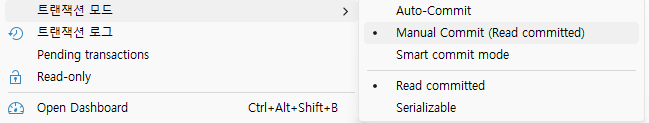

- Functions
    - 프로시저와 동일. 타입을 FUNCTION으로 선택, 확인

- Table Triggers
    - 생성된 트리거만 확인
    - 테이블 Triggers 탭에서 Create New Trigger로 생성, Declaration에서 작성
    - SQL 에디터에서 작성 

- 팁
    - 메뉴 > 데이터베이스 > 커밋, 롤백, 트랜잭션 모드 는 DB에 맞게 잘 사용할 것
    - Ctrl + + : 글자크기 크게
    - Ctrl + - : 글자크기 작게
    - 툴바의 접속된 세션(현재, XE - Scott)확인, 사용중인 스키마(현재 SCOTT) 작업 도중 자주 확인
    - `트랜잭션`은 UPDATE, DELETE 작업 전엔 반드시 확인하고 진행

    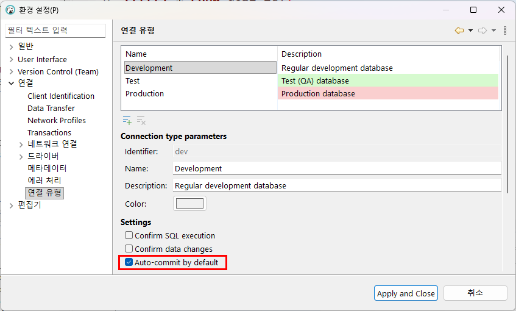

    - 각 테이블 마우스오른쪽 버튼 > SQL 생성
        - INSERT 부터 DDL까지 전부 존재
        - 단, SELECT 문은 거의 효과가 없음. 너무 단순. 


### 파이썬 오라클 연동

- 주피터노트북 사용
    - VS CODE > 명령 팔레트 실행(Ctrl + Shift + P)

- 오라클 `CRUD` 연동 - [소스](./day08/1.오라클연동.ipynb)
    - Create Read Update Delete 약자
    - INSERT SEELCT UPDATE DELETE 명령어와 1:1 매핑
    - 실무에서 CRUD를 분해해서 지시 (CRU, R, CRUD...)

- BULK INSERT - [소스](./day08/2.BulkInsert.ipynb)
    - 대용량 데이터 처리방법

### 데이터베이스 설계

- 데이터모델링
    - 현실세계 데이터를 DB내에 옮기기 위해 데이터베이스를 설계
    - `모델링 순서` - 요구사항 분석 > 개념적 모델링 > 논리적 모델링 > 물리적 모델링

- `프로그래밍 구현 순서`
    - 요구사항 분석 > 설계 > 구현/코딩 > 테스트 및 디버깅 > 배포 > 유지보수 및 운영
    - 모델링은 프로그래밍 구현의 설계에 포함

- 요구사항 분석
    - 업무를 파악하고, 개발자와 업무담당자 간의 의사소통으로 필요한 데이터 정의
    - DB 목적, 기능, 제약사항 정리 `요구사항 정의서` 산출

- 개념 데이터 모델링
    - 핵심 엔티티(테이블과 매핑)를 식별, 각 엔티티별 관계를 정의하는 논리구조 도식화
    - 추상화 ERD(Entity Relationship Diagram)를 작성

    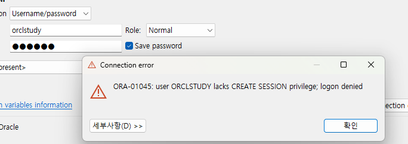

- 논리 데이터 모델링

    - 개념 데이터 모델링 바탕으로 속성, 키, 관계 명확히 정의
    - 데이터 중복을 최소하 하기위한 **정규화** 수행
    - 관계형 테이터 모델(테이블)로 구체화 
    - 논리(물리와 매칭) ERD 작성

    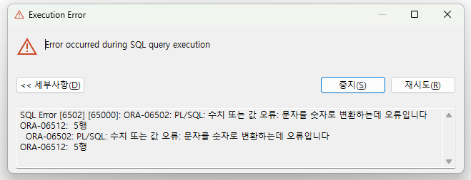

- 물리 데이터 모델링
    - 실제 사용하는 DBMS 특성(`Oracle`, MySQL, SQLServer...)를 고려해서 설계
    - 테이블, 컬럼, 인덱스, 제약조건, `시퀀스` 등 생성하고, 성능을 위해서 **반정규화** 진행
    - 최종 스키마 완성

    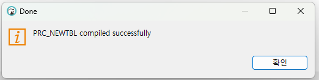

- 위 모델링을 1회성이 아닌, 기능 추가/변경으로 `지속적인 업데이트` 수행

### 데이베이스 모델링 툴

- 모델링 툴
    - 논리 /물리 모델링을 컴퓨터 상에서 할 수 있는 개발툴

- 종류
    - ERWin Data Modeler - 퀘스트 사에서 만든 ERD 작성 개발툴. 유료. 업계 표준 
    - eXERD - 한국산 모델링툴. 이클립스 기반, 유료
    - ER/Studio - 대규모 엔터프라이즈 데이터 아키텍처 모델링툴
    - Draw.io - https://app.diagrams.net/ 무료, 다양한 다이어그램. sql변환 불가
    - `erdcloud` - https://www.erdcloud.com/ 모델링에 물리 스키마까지 생성가능한 한국어 지원도구
    - DBeaver - 물리적 테이블 생성 후 다이어그램 확인 가능. 모델링은 불가. 뷰어
    - MySQL Workbench - 논리/물리적 다이어그램 생성 가능. 생성한 그대로 DB가 됨. 


## Day09

### 데이터베이스 모델링

#### 요구사항 분석

- DB설계자와 업무담당자(병원관계자)와 협의
    1. 의사관리, 간호사관리, 환자관리, 진료과관리, 입원처리, 진료처리... 
        - `의사`, `간호사`, `환자`, `진료과` -> 명사
        - `입원`, `진료` -> 동사
    2. 의사는 고유`의사번호`, `이름`, `진료과목`, `주소`, `전화번호`, `주민번호`, `직급`, `과번호`, `의사약력`, ...
    3. 간호사는 고유간호사번호, 이름, 진료과목, 주소, 전화번호, 주민번호, 직급, 과번호, ...
    4. 환자는 고유환자번호, 이름, 주민번호, 전화번호, 주소, 키, 몸무게, 혈액형, 성별, 진료과, ...
    5. 입원은 입원일, 퇴원일, 병실 정보
    6. 진료과는 고유의 과번호, 과이름, 전화번호, 팩스번호, ...
    7. 의사는 여려명의 환자를 진찰하고, 환자도 여려 명의 의사에게 진료받을 수 있음
    8. 진료를 받으면 고유진료번호, 진료일이 저장
    9. 간호사는 여러명의 환자를 처치할 수 있고, 처치일, 처치내용 등이 저장
    10. 진료내용은 여러값이 저장됨
    11. 의사, 간호사는 하나의 전공을 가짐
    12. 환자는 여러명 입원 할 수 있음
    13. 요구사항 명세서가 만들어짐

#### 개념설계

- DB설계자의 개념설계
    - 개체 추출
        - 진료과 아래, 키 - 과번호, 속성 - 과이름, 전화번호, 팩스번호
        - 의사 아래, 키 - 의사번호, 속성 - 이름, 진료과목, 주소, 전화번호, 주민번호, 직급, 과번호, 의사약력
        - 간호사 아래, 키 - 간호사번호, 속성 - 이름, 진료과목, 주소, 전화번호, 주민번호, 직급, 과번호        
        - 환자 아래, 키 - 환자번호, 속성 - 이름, 주민번호, 전화번호, 주소, 키, 몸무게, 혈액형, 성별, 진료과        
        - 입원 - 병실, 입원일, 퇴원일
    - 관계 추출
        - `진료` - `의사`가 `환자`를 진료, 속성 - 진료번호, 진료일
        - `처치` - `간호사`가 `환자`를 처치, 속성 - 처치일, 처치내용
        - `입원` - `환자`가 `병실`에 입원, 속성 - 병실, 입원일, 퇴원일
        - ~~`퇴원` - `환자`가 `병실`에서 퇴원~~
        - 다대다(n:m) 관계는 만들지 않음. 물리 DB에서 이를 구현할 수도 없음. `추후학습요`

    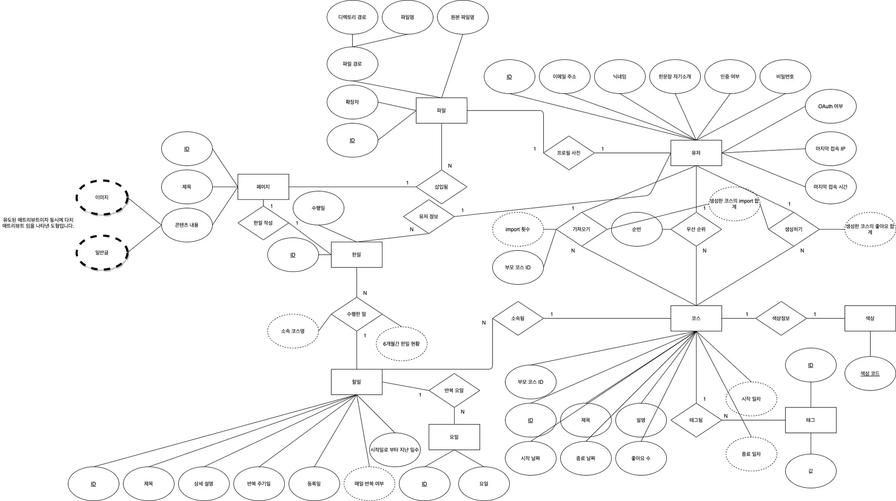

#### 논리설계

- 중간 미팅단계
    - 의사와 간호사의 주민번호는 불필요하다고 협의됨
    - 의사약력도 불필요 

- 논리설계 이전 기본키/외래키, 일반속성 정립
    - 진료과 - `과번호`, 과이름, 전화번호, 팩스번호
    - 진료 - `진료번호`, _의사번호_, _환자번호_, 진료일, 진료내용
    - 의사 - `의사번호`, 이름, 주소, 전화번호, ~~주민번호~~, 직급, _과번호_, ~~의사약력~~
    - 간호사 - `간호사번호`, 이름, 주소, 전화번호, ~~주민번호~~, 직급, _과번호_
    - 환자 - `환자번호`, 이름, 주민번호, 전화번호, 주소, 키, 몸무게, 혈액형, 성별, **진료과**, **처치일**, **처치내용**
    - 입원 - `입원번호`, 환자번호, 입원일, 퇴원일, 병실

- 도메인
    - 특정 컬럼에 들어가는 값의 범위
    - 초등학교 1~6, 대학교 1~4학년

- DB설계는 일회성이 아니고, 중간에 계속 변경가능
    
#### ERDCLOUD 사용법 및 모델링

- 회원가입 후 로그인

1. ERD 생성 클릭

    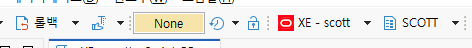

2. 새로운 엔티티 추가
    - 노란색 + : 키 추가
    - 하늘색 + : 컬럼 추가

    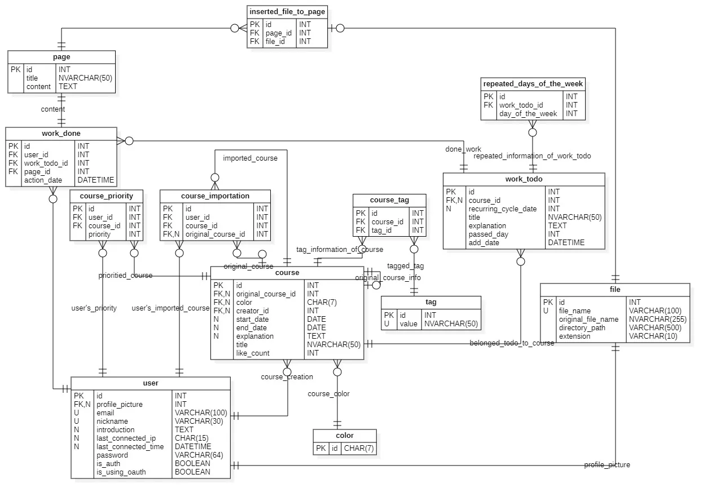

3. 관계(없거나 한개 또는 여러개) 클릭
    - 부모테이블 클릭 후 자식테이블 클릭
    - 식별관계와 비식별관계 선택
    - 식별관계는 부모의 PK가 자식의 PK이면서 FK - 무조건 NOT NULL
    - 비식별관계는 단순 FK - NOT NULL 또는 NULL 모두 허용

    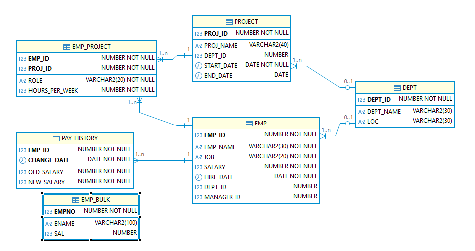

    - 결과

    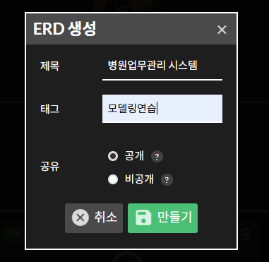

4. 각 엔티티와 키와 속성 관계로 논리 다이어그램 작성

    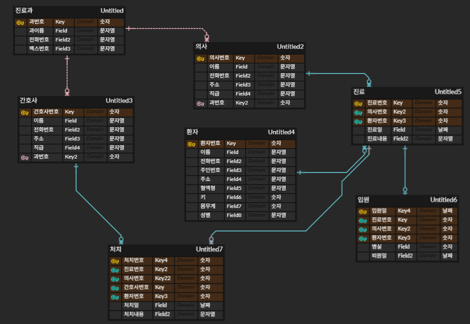

5. 물리 다이어그램으로 변경 작성. 각 데이터 타입 수정

    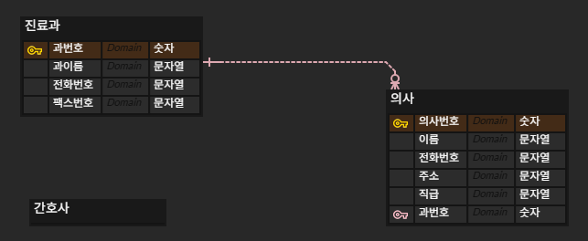

6. 내보내기 클릭 - [쿼리](./day09/3.병원물리스키마_비식별관계.sql)
    - DB종류 선택 - 현재 Oracle
    - PK제약조건, FK제약조건, 비식별 제약조건 추가 선택
    - SQL 미리보기 클릭 후, 미리보기 복사

    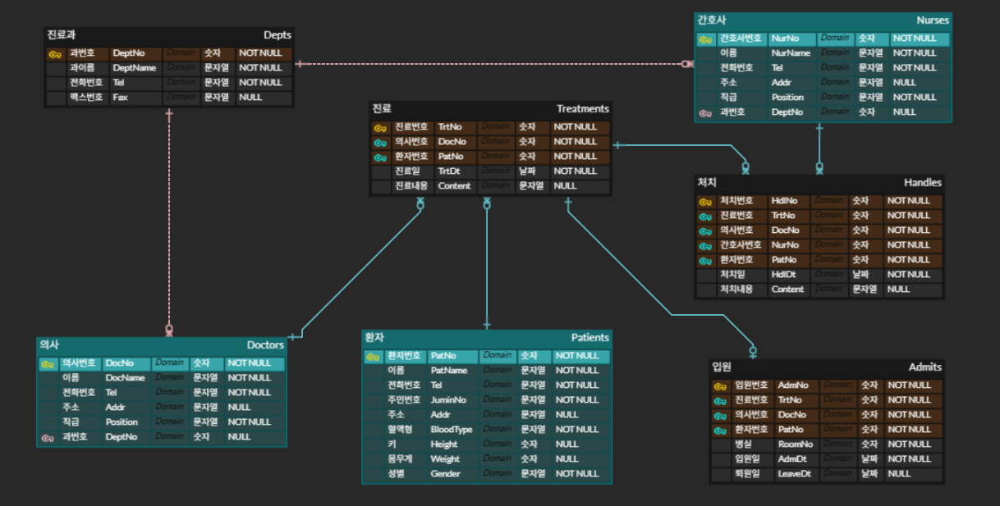

7. DB툴에서 복사한 쿼리로 실행

    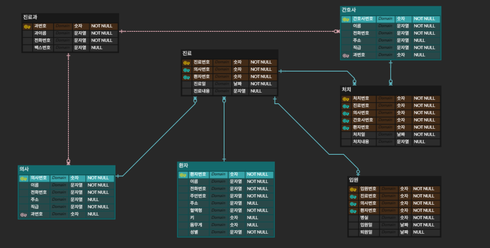

#### 모델링 시 주의점

- 식별관계로 모델링을 하면 JOIN 할 때 많은 키(PK/FK)를 조인절에 포함해서 복잡
- ERDCloud에서 식별관계 SQL쿼리를 제대로 생성못함
- 관계에서 부모쪽 연결, 1(NOT NULL)과 0..1(NULL)의 차이 파악할 것

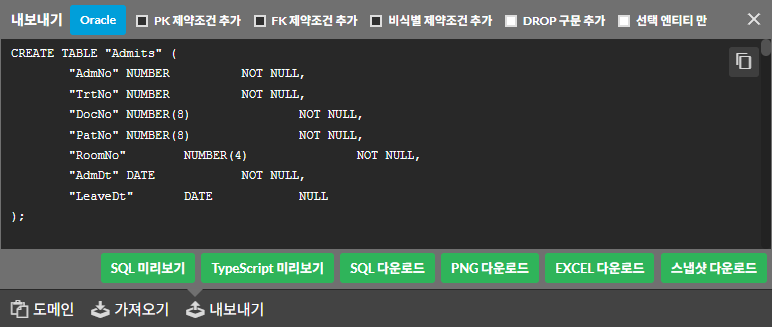

## Day10

### DBeaver 팁

- 자동완성 기능으로 사용에 불편한점
    - 

### 인덱스 연습 프로젝트

- 개요
    - 인덱스이 필요성, 성능 확인
    - 인덱스 없이 조회는 느림, 인덱스를 생성 조회 빠름
    - 아무 컬럼에나 인덱스걸면 안됨 -> 반대로 조회 느려짐
    - 보통 `인덱스를 건다`라고 이야기함

#### 테스트 실행 순서

- 주문 테이블 생성 - ORDERS_BIG - [쿼리](./day10/1.인덱스테스트용_테이블.sql)
- 300만건 더미데이터 생성 - [쿼리](./day10/2.300만건테이터.sql)
- 인덱스 테스트 - [쿼리](./day10/3.인덱스테스트_쿼리.sql)


