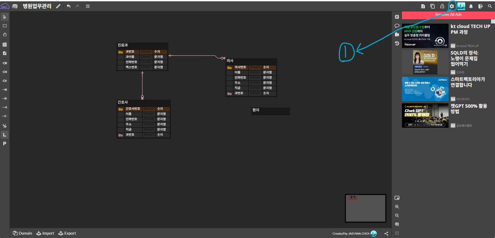

# 실무 DBeaver 활용 꿀팁 정리

파일안에도 sql 기능 저장 가능함.

한번 Alt  + X 키를 누르면 아래에 Statistics 탭이 나옴.

DBeaver 프로그램에서 데이터 값을 조회할 때는 Ctrl + Enter 키를 누르기(한 줄씩만 실행가능함)

🌟 DBeaver 행 번호 표시하는 방법

윈도우 → 환경설정 → 행 번호 표시 클릭

셀에 공백과 NULL있는 것은 완전히 다르다!!

🌟 Database Navigator에 Connection 하나 생성하는 법(중요!!)

Oracle 클릭 - Connection Type에 있는 Basic 탭에 있는 데이터 베이스 입력창에서 “XE - system” 입력 - Password 있으면 입력하기 → 만약 Username 과 password가 틀려서 오류창이 뜨게 된다면, 마우스 우클릭 후 Edit Connection 눌러서 다시 수정하기  → Test Connection 클릭 후 완료 버튼 누르기

***DBeaver에서 소계와 총계를 나타내는 것은 ROLLUP이며, 실제 실무에서 많이 쓰임.***

***기업 경영진들이 원하는 것은 PIVOT 함수(아예 가로형태로 된거) 이다.***

***실무에서는  별(*) 을 안쓰고 별명 테이블 컬럼을 많이 쓴다.***

***실무에서는 등가조인 안쓰고 내부조인(INNER JOIN)이라 부름.***

***조인(Join) 을 백화점으로 비유하자면 왼쪽 조인은 전체고객이며, 오른쪽 조인은 일부고객이다.***

***오른쪽 조인에 있는 내부 이너조인은 스팸 O 고, 외부 이너조인은 스팸 X 라고 생각하면 쉬움!!***

***실무에서는 컬럼 빼기 금지!!***

***공백은 NULL이 아니다. NULL은 NULL이다.***

***강사님 말씀대로 실무에서 SELECT, UPDATE 명령어를 작성할 때 Ctrl + Enter키 누른 후 경고창 뜨면 Do not ask me again 체크는 절대 금지!!!***

***회사에선 데이터가 돈임!!***

***delete 문 잘못 날리면 도망가기!!***

***실제 실무에서는 트랜잭션에서 Auto-commit을 안함.***

***update나 select이 잘못 실행 됬을 때 RoLLback 하면 원상 복구 됨.***

🌟 트랜잭션

트랜잭션은 ATM으로 비유하자면 돈을 100만원 입출금 했을때, 잔고가 100만원 그대로인 현상임.

반면, 트랜잭션에 있는 COMMIT은 100만원 돈을 입출금 했을 때 정상적으로 처리된 상태랑 똑같음.

ROLLBACK은 ATM 내역이 오류가 나면 복구(restoration) 하는 것을 말함.

<트랜잭션 요약 정리>
트랜잭션 - ATM
COMMIT - 정상처리 된 상태
ROLLBACK - 오류 복구 하는 것

***테이블에 컬럼을 추가하고 싶어도 추가 못하는 경우도 있음.***

나중에 실무가면 80 ~ 90%는 TCL, DDL 을 많이 함. 그리고 ALTER TABLE 할 일은 거의 없음.

뷰(view)를 쇼핑몰로 쉽게 설명하자면 민감한 급여, 보너스, 주민번호, 비밀번호, 집주소를 노출하지 않는 것을 말함.

Primary는 무조건 Index 걸림!!

제약조건의 예를 들자면 인스타, 유튜브, 구글에서 회원가입을 할 때  아이디와 비밀번호 입력 창에 비워둘 수 없는 것을 말함.

***PK(PRIMARY KEY)는 UNIQUE의 NOT NULL(그렇게 하면 오류 잘 안남!!)***

실무에서는 PK키 최소 3개에서 8개까지 걸림.

DBeaver에서 erd에 동그라미 위에 있는 0..1은 0 또는 1이다.

SCOTT은 일반 사용자이다. 

***데이터베이스에서 orclstudy면 사용자 이름(Username)을 orclstudy로 입력해주기!!***

DBMS(Data Base Management System)

DBeaver에서 커서쓰면 훨씬 간단함 

FUNCTION과 PROCEDURE 조심하기!!

트리거는 권총의 방아쇠를 생각하면 쉬움. 실무에서는 DML 트리거를 많이 씀.

병원 DB 정보에서는 층수 필요없음!!

😊 Visual Studio Code에 [README.md](http://README.md) 있는 내용을 제외할려면 **물결표 2개 `~~`** 로 감싸면 됨.

README.md에서는 다음처럼 작성함.

```
~~주민번호~~
```

결과

```
~~주민번호~~
```

***DB에서는 상대방의 요구사항을 마음대로 빼기 절대 금지.  요구사항 있는 것들은 다 적기!!***

증빙만 남기면 서류 문제 될 일은 없음.

없거나 한개, 없거나 여러 개 

병원 DB에서는 의사번호 없이 식별 불가

Level이란 단어는 많이 안쓰는게 좋음.

## 1️⃣ Physical Name 숨기는 방법 (가장 간단)

1. **ERD 빈 공간 클릭**
2. **오른쪽 상단 톱니바퀴(Settings)** 또는 **Display 설정**
3. **Name Display 옵션 변경**

다음 중 하나 선택

- **Logical Name Only** ✅




다대다 관계는 무조건 풀기!!

금융, 은행권은 돈을 중요시하는 만큼 식별관계가 많음!!

🌟 실무 ERD 링크(강사님 말씀대로 한번 보면 도움 많이 됨)

https://www.erdcloud.com/d/PK2Ae7d4asTRqHpHx

https://shout-to-my-mae.tistory.com/427

실제 실무에서는 ERDCloud를 안 쓸 수도 있음.

***실무에서 DB설계 한다면 “네, 하겠습니다”라고 하되, 궁금하거나 모르는 점 있으면 선배님께 물어보기***

🌟 DBeaver에서 다이어그램 생성 후 NUMBER, VARCHAR, DATE, NULL, NOT NULL을 보이게하는 법


테이블에 있는 Comment 주황색 박스는 변경 안된 것임.

동시성 제어 - 트랜잭션이며 락, 커밋, 롤백, 세션만 알고 있으면 됨.

인덱스 - 조회

동시성제어 - 트랜잭션의 형태이며, 300만권으로 테스트 해봤는데 인덱스 있는 것과 없는 것은 차이가 많이 났습니다.

동시성 제어 해봤어요?

실제 실무에서는 DB 운영하는 것은 안주고 가짜 DB를 만들기. 가끔은 NULL도 있지만 대부분 NOT NULL이 있음.

요즘에는 5분마다 자동저장, 10분마다 자동저장 기능이 있음.

아이디가 있으면 밑에서 부터 본다. 2→ 1 → 0순으로!!

***인덱스 걸면 인덱스를 만들어야 한다.  컴퓨터에서의 1.8초는 많이 걸리는 것임.***

 

작업할 때는 무조건 확장자 보고하기!


😎 Procedure에서 파라미터를 생성하는 방법 

Procedures 우클릭 → Create New Procedure 클릭 → FUNCTION 창에 있는 이름(name) 입력하기 → 확인 버튼 클릭하기

😍 Database Navigator 창에 DDL 테이블을 생성하는 법 

SCOTT 마우스 우클릭 → SQL 생성 → DDL

😍 DBeaver에서 ERD 설정하는 법

아래 톱니 바퀴 모양 클릭 후 Notation type에서 Crow’s Foot 설정 후 적용 클릭하기 → Apple and close 버튼 클릭하기 

😎 Visual Studio에서 scott 서버 연결하는 법

DATABASE 창에서 + 버튼 클릭하기 → 이름은 DockerOracle_scott으로 변경 → 서버 유형 Oracle 선택 → 데이터베이스 XE 입력 → 연결 중 → 저장 클릭

😎 뷰(View) 보는 방법

Schemas 탭에 있는 SCOTT 마우스 우클릭 후 새로고침 누르기

😎 DBeaver 실행창에서 COMMIT 하는 방법

DBeaver 실행창에서 COMMIT 을 입력한 후 드래그 하기 → Ctrl + Enter 키를 누르고 저장